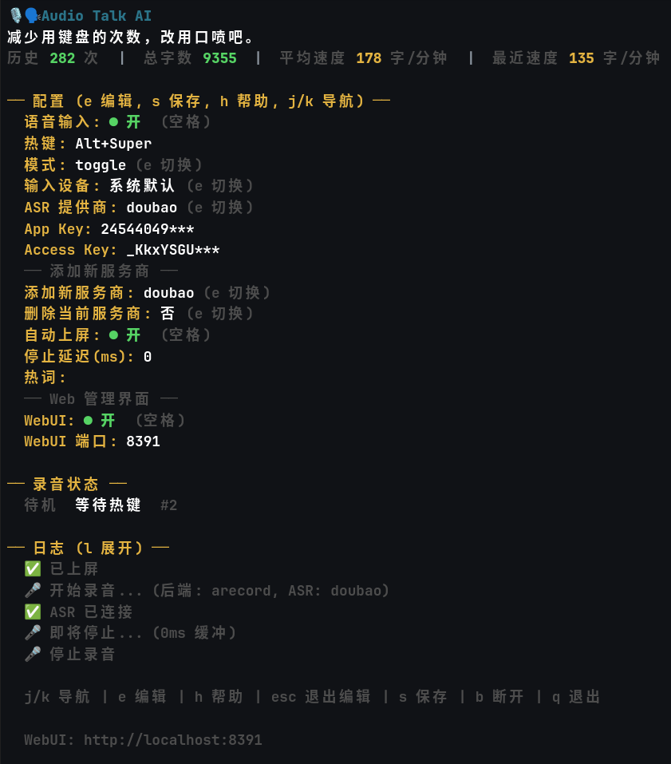
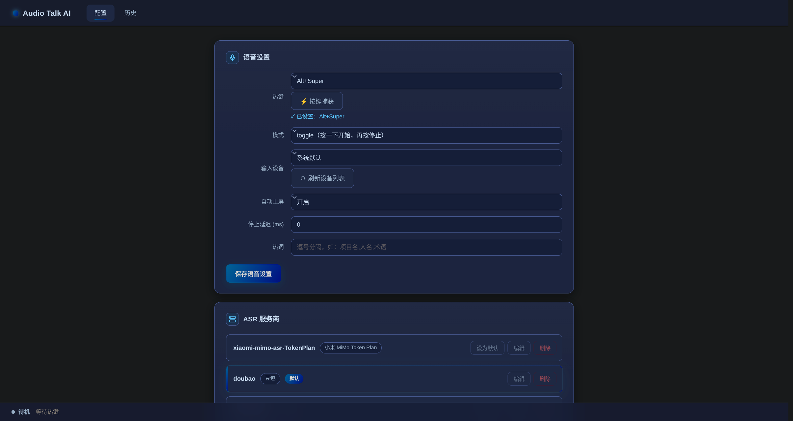
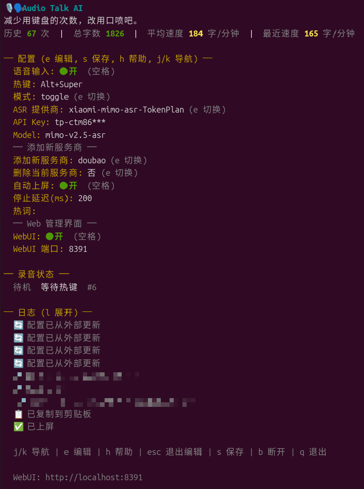

# Audio Talk AI

[中文](README.md) | [Project Structure](PROJECT_STRUCTURE.md) | [ASR Providers Guide](docs/asr-providers-guide.md) | [iFlytek ASR Guide](docs/xfyun-guide.md)

Type less, speak more.

Audio Talk AI is a desktop voice input tool. It records audio with a global hotkey, sends it to a streaming ASR service, and copies the recognized text to the clipboard or submits it directly into the focused input field. Ideal for coding, chatting, note-taking, and long text input.

Supports multiple ASR providers with one-click switching in the TUI.

## Screenshots

### TUI



### Web UI — Configuration



### Web UI — Transcription History



## Features

- Global hotkey recording with `toggle` (press to start, press again to stop) and `hold` (press and speak) modes.
- 12 ASR providers with dynamic switching in TUI:
  - **Doubao** (ByteDance Volcengine) — streaming ASR, real-time partial results
  - **OpenAI Realtime** — streaming ASR via WebSocket
  - **OpenAI Whisper** — batch transcription, compatible with Ollama and other OpenAI-format services
  - **iFlytek Spark** — streaming ASR with dynamic correction and 202 dialects
  - **iFlytek IAT** — streaming ASR with vertical domains (medical/gov/finance) and dialect auto-switch
  - **iFlytek RTASR** — streaming ASR, large model, up to 8 hours, speaker diarization
  - **iFlytek RTASR Standard** — streaming ASR, standard edition, up to 5 hours, apiKey auth
  - **iFlytek LFASR** — batch transcription, standard edition, up to 5 hours
  - **iFlytek LFASR LLM** — batch transcription, 202 dialects / 37 languages auto-switch
  - **iFlytek LFASR Fast** — batch transcription, ~20s for 1-hour audio
  - **Xiaomi MiMo** — batch transcription, Chinese/English and dialect support
  - **Xiaomi MiMo Token Plan** — batch transcription, domestic (China) endpoint
- Automatic clipboard copy and auto-submit into focused input field.
- Always-on-top recording status overlay for Wayland, X11, macOS, and Windows.
- TUI configuration with add/remove/switch ASR providers, dynamic credential fields, and interactive hints on all dropdowns.
- ASR hotwords for project names, people names, English terms, and domain-specific vocabulary.
- Usage statistics: total sessions, total characters, average speed, and recent speed.

## Platform Status

| Platform | Status | Notes |
| --- | --- | --- |
| Linux Wayland | Supported | Hotkeys via evdev (requires input group); clipboard via wl-clipboard, auto-submit via wtype or uinput |
| Linux X11 | Supported | Native X11 global hotkeys and XTest auto-submit |
| macOS | Supported | Hotkeys via CGEventTap, recording via CoreAudio, clipboard via NSPasteboard |
| Windows | Supported | Hotkeys via WH_KEYBOARD_LL low-level keyboard hook, recording via ffmpeg/sox, clipboard via native Win32 API, auto-submit via SendInput simulating Ctrl+V (pure Go, no CGO) |

## Build

Audio Talk AI uses native platform APIs: Linux and macOS builds require cgo, while the Windows build is pure Go (no CGO; it calls Win32 via `golang.org/x/sys/windows`).

```bash
# Linux (Debian / Ubuntu)
sudo apt install golang-go build-essential libx11-dev libxtst-dev libxext-dev libxinerama-dev libwayland-dev

# Linux (Arch)
sudo pacman -S --needed go gcc libx11 libxtst libxext wayland

# macOS
xcode-select --install
```

```bash
git clone https://gitee.com/AY77-OP/audio-talk-ai.git
cd audio-talk-ai
make build          # or go build -o build/audio-talk-ai ./cmd/audio-talk-ai
make install        # installs to ~/.local/bin/
```

**Windows build** (no cgo required):

```powershell
# Requires Go 1.25+; recording needs ffmpeg (recommended) or sox, add it to PATH
go build -o audio-talk-ai.exe ./cmd/audio-talk-ai
# Or use the Makefile (git-bash / WSL): make build
# Run --install to install into %LOCALAPPDATA%\Programs\audio-talk-ai\
audio-talk-ai.exe --install
```

## Usage

```bash
audio-talk-ai              # TUI mode (default, single instance)
audio-talk-ai --no-tui     # daemon mode
audio-talk-ai --doctor     # environment check
audio-talk-ai --backend wayland   # force Wayland
audio-talk-ai --backend x11      # force X11
```

### Detachable Session

> **Note**: detachable session mode (`--d`/`--di`) is built on Unix sockets + PTY and is **only available on Linux / macOS**; on Windows these flags return an explicit error.

Press `Ctrl+]` or `b` to detach — Audio Talk AI keeps running in the background (hotkeys still work). Press `q` to end the session. Requires `fzf` for session selection (auto-connects when only one session exists).

```bash
audio-talk-ai --d          # start a detachable TUI session
audio-talk-ai --di         # reattach to existing session
audio-talk-ai --list       # list active sessions
audio-talk-ai --detach 1   # stop a session by number
```

| Key | Action |
|-----|--------|
| `Ctrl+]` or `b` | Detach to background (session preserved) |
| `q` | End session |

### Web Management UI

Open `http://localhost:8391` in your browser to:

- Configure voice settings (hotkey, mode, auto-submit, etc.)
- Add/remove/edit ASR providers
- View transcription history

Port can be changed in TUI or in config:

```toml
[web]
enabled = true
port = 8391
```

## Configuration

Config file: `~/.config/audio-talk-ai/config.toml` (Windows: `%APPDATA%\audio-talk-ai\config.toml`)

### Secret Encryption & Migration

Starting from this version, API secrets in the config are stored encrypted with **AES-256-GCM** as `enc:<base64>`. The decryption key lives in `~/.config/audio-talk-ai/key` (mode `0600`, readable only by you; on Windows `%APPDATA%\audio-talk-ai\key`, protected by the per-user directory ACL). Plaintext secrets exist in memory only while the program runs.

- **Upgrading from a plaintext config**: on first launch (or first save) with the new version, plaintext secrets are encrypted and written back automatically. The original file is backed up and the ciphertext is verified to decrypt correctly before anything is overwritten, so your data is never destroyed.
- **Downgrading to an old version is NOT compatible**: old versions do not understand the `enc:` prefix and will treat the ciphertext as the real key, causing auth failures. If you must downgrade, view and note the plaintext secrets from the TUI / WebUI before downgrading.
- **Backup & migration**: treat `config.toml` and `key` as a pair. Copying only the encrypted config without `key` (or lacking `key` on another machine) makes the ciphertext undecryptable and the program won't start.
- **Health check**: run `audio-talk-ai --doctor` and look at the "密钥加密" (secret encryption) item to confirm there are no plaintext secrets and the key file permissions are correct.

### Basic Config

```toml
[voice]
mode = "toggle"
push_to_talk = "F9"              # default F9; Alt+Super and other combos also work
language = "zh-CN"
auto_submit = true               # auto-submit; false = clipboard only
# hotwords = ["project-name", "person-name", "term"]
```

### ASR Provider Config

You can configure multiple providers and switch in TUI. Without `[[asr_providers]]`, you can put `app_key` / `access_key` directly in `[voice]` (backward compatible).

```toml
# Doubao ASR (streaming, recommended)
[[asr_providers]]
name = "doubao"
type = "doubao"
default = true
app_key = "your_app_key"
access_key = "your_access_key"

# OpenAI Realtime (streaming)
# [[asr_providers]]
# name = "openai"
# type = "openai-realtime"
# api_key = "sk-..."
# model = "gpt-4o-mini-transcribe"

# OpenAI Whisper (batch, compatible with Ollama etc.)
# [[asr_providers]]
# name = "whisper"
# type = "openai-whisper"
# api_key = "sk-..."
# model = "whisper-1"
# endpoint = "http://localhost:11434/v1/audio/transcriptions"

# iFlytek Spark (streaming, dialect support)
# [[asr_providers]]
# name = "xfyun"
# type = "xfyun-spark"
# app_id = "your_app_id"
# api_key = "your_api_key"
# api_secret = "your_api_secret"

# Xiaomi MiMo (batch)
# [[asr_providers]]
# name = "mimo"
# type = "xiaomi-mimo-asr"
# api_key = "your_mimo_api_key"
# model = "mimo-v2.5-asr"

# Xiaomi MiMo Token Plan (batch, domestic endpoint)
# [[asr_providers]]
# name = "mimo-token"
# type = "xiaomi-mimo-asr-TokenPlan"
# api_key = "your_mimo_api_key"
# model = "mimo-v2.5-asr"
```

### Hotkey Notes

Voice hotkeys only support keys suitable for global shortcuts:

- Supported: `Alt+Super`, `Ctrl+Alt+Shift`, `F9`, `Alt+F8`, `Tab`, `CapsLock`, etc.
- Not supported: letters, digits, punctuation, Space, and other text-producing keys

macOS hotkey syntax: `Option` = Alt, `Command`/`Cmd` = Super

```toml
push_to_talk = "Option+Command"
```

Windows hotkey syntax: `Win` key = Super (e.g. `Win+Alt`), `Ctrl` = Control

```toml
push_to_talk = "Win+Alt"
```

## Hotkeys

| Hotkey | Action |
|--------|--------|
| Recording hotkey | Start/stop recording |
| `Esc` | Cancel current recording |
| `R` | Retry last recognition error |

## Let Your AI Agent Install This for You

Copy the prompt below to your AI assistant — it will install and configure Audio Talk AI automatically.

<details>
<summary>Click to expand prompt</summary>

```
You are helping a user install Audio Talk AI, a desktop voice input tool.

INSTALLATION:
First, ask the user which installation method they prefer:
- **Binary** (pre-built, ~9MB, no compiler needed — recommended for most users)
- **Source** (build from source, requires Go 1.25+ and build tools)
If the user has no preference, default to Binary.

ENVIRONMENT DETECTION (run these checks BEFORE installing):
1. Sudo access: run `sudo -n true 2>/dev/null`. If exit code is 0, set HAS_SUDO=true; otherwise HAS_SUDO=false.
2. Config directory (in this priority order):
   a. If $XDG_CONFIG_HOME is set → CONFIG_DIR=$XDG_CONFIG_HOME/audio-talk-ai
   b. Otherwise (Linux, macOS etc.) → CONFIG_DIR=~/.config/audio-talk-ai
3. Install path:
   a. If HAS_SUDO=true → INSTALL_DIR=/usr/local/bin
   b. Otherwise → INSTALL_DIR=~/.local/bin (create it if needed, and remind user to add to PATH)

REPOSITORIES (use whichever is accessible to the user):
- Gitee (primary, China-friendly): https://gitee.com/AY77-OP/audio-talk-ai
- GitHub (mirror, international): https://github.com/SilverKurali/audio-talk-Ai

Method A — Pre-built binary:
1. TMPDIR=$(mktemp -d) && cd "$TMPDIR"
2. Get latest release URL dynamically:
   curl -s https://gitee.com/api/v5/repos/AY77-OP/audio-talk-ai/releases/latest | python3 -c "import sys,json; r=json.load(sys.stdin); print(next(a['browser_download_url'] for a in r['assets'] if 'audio-talk-ai' in a['name'] and not a['name'].endswith('.zip') and not a['name'].endswith('.tar.gz')))"
   If the API call fails or returns no valid URL, fall back to:
   https://gitee.com/AY77-OP/audio-talk-ai/releases/download/v0.1.0/audio-talk-ai
3. curl -L -o audio-talk-ai "$DOWNLOAD_URL"
   (If Gitee is unreachable, fall back to Method B using the GitHub mirror)
4. chmod +x audio-talk-ai && mv audio-talk-ai "$INSTALL_DIR/"
5. If INSTALL_DIR=~/.local/bin and it is NOT in $PATH, warn user:
   echo 'export PATH="$HOME/.local/bin:$PATH"' >> ~/.bashrc  (or ~/.zshrc)
6. mkdir -p "$CONFIG_DIR"
7. Download config example: curl -L -o "$CONFIG_DIR/config.toml.example" https://gitee.com/AY77-OP/audio-talk-ai/raw/master/config.toml.example
8. If "$CONFIG_DIR/config.toml" does NOT exist: cp "$CONFIG_DIR/config.toml.example" "$CONFIG_DIR/config.toml"
9. Cleanup: cd ~ && rm -rf "$TMPDIR"
10. Verify: audio-talk-ai --doctor
11. If any step fails → fall back to Method B.

Method B — Build from source (requires Go 1.25+ and build tools):
1. TMPDIR=$(mktemp -d) && cd "$TMPDIR"
2. git clone --depth 1 <repo_url> .  (use Gitee or GitHub URL from above)
3. Check build deps (Linux): build-essential, libx11-dev, libxtst-dev, libxext-dev, libxinerama-dev, libwayland-dev
   - If HAS_SUDO: sudo apt install -y <missing_deps>
   - If NO sudo: list missing packages and ask the user to install them manually, then retry
4. Build: CGO_ENABLED=1 go build -o audio-talk-ai ./cmd/audio-talk-ai
5. mv audio-talk-ai "$INSTALL_DIR/"
6. If INSTALL_DIR=~/.local/bin and it is NOT in $PATH, warn user (see Method A step 5)
7. mkdir -p "$CONFIG_DIR" && cp config.toml.example "$CONFIG_DIR/config.toml.example"
8. If "$CONFIG_DIR/config.toml" does NOT exist: cp "$CONFIG_DIR/config.toml.example" "$CONFIG_DIR/config.toml"
9. Cleanup: cd ~ && rm -rf "$TMPDIR"
10. Verify: audio-talk-ai --doctor

CONFIGURE:
- Edit "$CONFIG_DIR/config.toml" — user must fill in at least one ASR provider's API keys.
- For provider details, read "$CONFIG_DIR/config.toml.example" or docs/asr-providers-guide.md from the repo.

IMPORTANT RULES:
- Always reply in the same language the user writes in (Chinese→Chinese, English→English, etc.).
- Walk the user through each step. If a step fails, troubleshoot before moving on.
- After installation, explain: hotkey (default F9) to start recording, how to switch ASR providers in TUI (press e on the provider field), and the WebUI at http://localhost:8391.
- Supported providers: doubao, openai-realtime, openai-whisper, xfyun-spark, xfyun-iat, xfyun-rtasr, xfyun-rtasr-std, xfyun-lfasr, xfyun-lfasr-llm, xfyun-lfasr-fast, xiaomi-mimo-asr, xiaomi-mimo-asr-TokenPlan.
```

</details>

## Changelog

See [CHANGELOG.md](CHANGELOG.md).

## Credits

- Voice input core based on [github.com/whoamihappyhacking/just-talk-go](https://github.com/whoamihappyhacking/just-talk-go)
- Detachable session (di mode) based on [github.com/whoamihappyhacking/di](https://github.com/whoamihappyhacking/di)

## License

Audio Talk AI is licensed under the GNU General Public License v3.0.

**No commercial use.** This project is for learning and personal use only. Any commercial use is prohibited.
